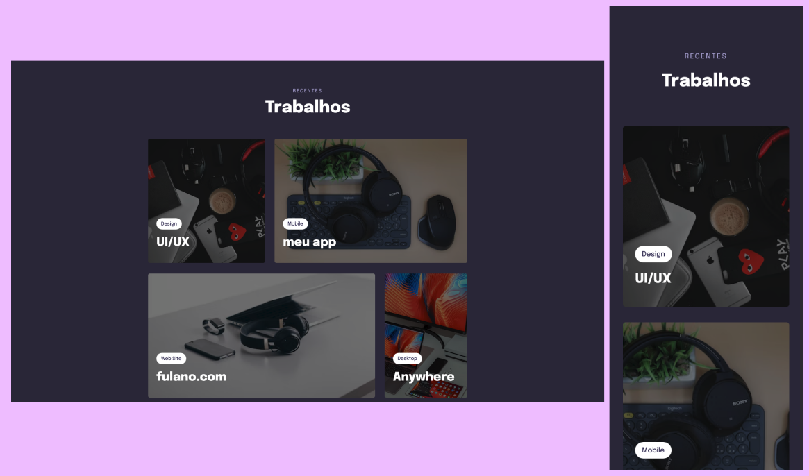

<h1 align="center"> Componente Trabalhos </h1>

  <a href="#-tecnologias">Tecnologias</a>&nbsp;&nbsp;&nbsp;|&nbsp;&nbsp;&nbsp;
  <a href="#-projeto">Projeto</a>&nbsp;&nbsp;&nbsp;|&nbsp;&nbsp;&nbsp;
  <a href="#-layout">Layout</a>

 

  

## 🚀 Tecnologias

Esse projeto foi desenvolvido com as seguintes tecnologias:

- HTML e CSS
- Git e Github

## 💻 Projeto

Este projeto foi desenvolvido em aula do Stage 03 do curso Explorer da Rocketseat para aprendizado de media queries, display:grid e clamp(), entre outros.

Você pode visualizar o projeto através [DESSE LINK](https://viviansanchez.github.io/rocketseat-explorer-stage03-projeto03/)!

## 🔖 Layout

Você pode visualizar o layout de inspiração do projeto através [DESSE LINK](<https://www.figma.com/file/v53lxlXoxtg9fjTVkjkXRi/Explorer-Stage-03-Projeto-02-(Copy)?node-id=203%3A1745&t=TzNW2LKb10ZeoPxj-0>). É necessário ter conta no [Figma](https://figma.com) para acessá-lo.
